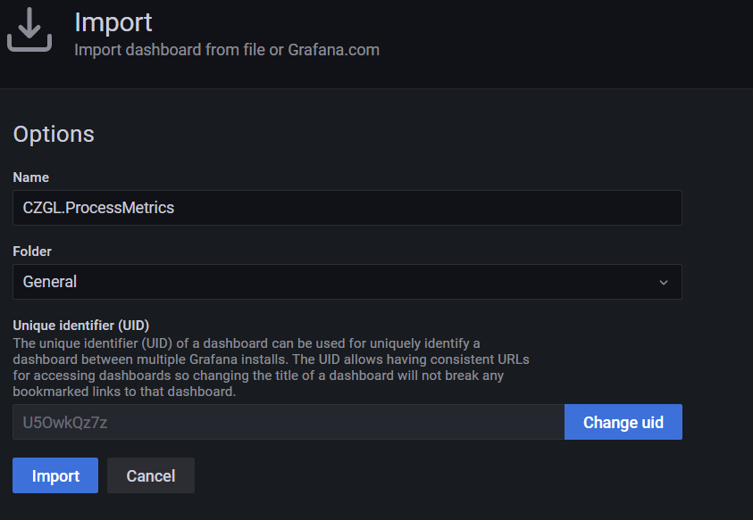
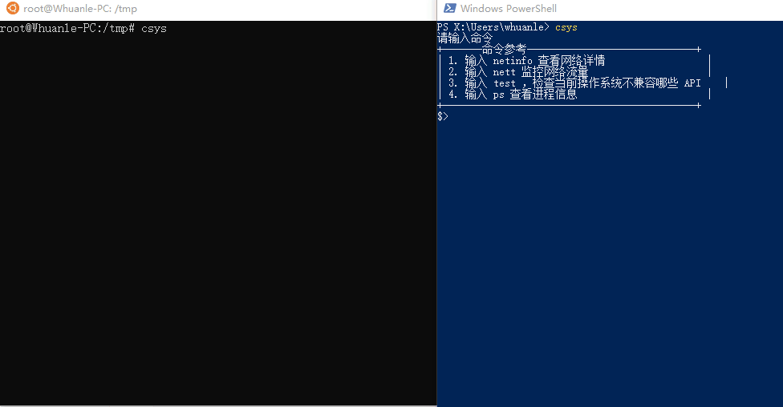

### 简介

CZGL.SystemInfo 是一个支持 Windows 和 Linux 等平台的能够获取机器硬件信息、采集机器资源信息、监控进程资源的库。

在不引入额外依赖的情况下，使用 .NET Runtime 本身的 API，或通过计算获得信息，提供高性能的计算方式以及缓存，提高性能，还提供 dotnet tool 工具，通过命令行在终端使用。 


Windows 可以使用 System.Diagnostics.PerformanceCounter 、System.Management.ManagementObjectSearcher 分别获得性能计算器以及机器的 CPU型号、磁盘序列化号等信息。

平台差异而且很难统一，所以如获取某些硬件的型号序列化，获得进程信息的资源信息，这些需求调用系统相关的API或者使用命令行操作，需要自己定制。


### 预览

CZGL.ProcessMetrics 是一个 Metrics 库，能够将程序的 GC、CPU、内存、机器网络、磁盘空间等信息记录下来，使用 Prometheus 采集信息，然后使用 Grafana 显示。

视频地址：

[https://www.bilibili.com/video/BV18y4y1K7Ax/](https://www.bilibili.com/video/BV18y4y1K7Ax/)

教程地址：[https://github.com/whuanle/CZGL.SystemInfo/blob/primary/docs/Metrics.md](https://github.com/whuanle/CZGL.SystemInfo/blob/primary/docs/Metrics.md)


### 使用在线监控

可通过 Prometheus 采集程序信息，接着使用 Grafana 分析、显示数据。

CZGL.ProcessMetrics 支持 .NET Standard 2.0 和 .NET Core 3.1，但是在 .NET Standard 2.0 中，因为缺少部分 Core API，所以有部分信息是无法获取的，这部分信息如下：

| 标识                         | .NET Core API               | 说明             |
| ---------------------------- | --------------------------- | ---------------- |
| gc_memory_info               | GC.GetGCMemoryInfo()        | 获取 GC 内存信息 |
| total_allocated_bytes        | GC.GetTotalAllocatedBytes() | 总分配量         |
| dotnet_lock_contention_total | Monitor.LockContentionCount | 线程池竞争数量   |


CZGL.ProcessMetrics 支持 .NET Framework 、.NET Core。


#### 使用方法

有两种方式使用 Metrics，第一种是使用内置的 HttpListener，不需要放到 Web 中即可独立提供 URL 访问，适合 winform、wpf 或纯 控制台等应用。但是使用 HttpListener，需要使用管理员方式启动应用才能正常运行。

使用方法：

```csharp
using CZGL.ProcessMetrics;
... ...
MetricsServer metricsServer = new MetricsServer("http://*:1234/metrics/");
metricsServer.Start();
```


另外一种是使用 ASP.NET Core，Metrics 作为中间件加入到 Web 应用中，此时使用的是 kestrel 。

在 Nuget 中，搜索 `CZGL.ProcessMetrics.ASPNETCore` 包，然后使用中间件生成 Metrics 端点。

```csharp
            app.UseEndpoints(endpoints =>
            {
                endpoints.MapControllers();
                endpoints.ProcessMetrices("/metrics");
            });
```


但是目前无论哪种，都必须让暴露端口出去，让 Prometheus 能够访问到 API。后期会增加支持不需要暴露 API 、提供 Web 服务，即可直接推送监控信息到 Prometheus 的功能。


访问 `/metrics` 可以查看到记录的信息。

打开 Prometheus 的 prometheus.yml 文件，在最后加上：

```yaml
  - job_name: 'processmetrice'
    metrics_path: '/metrics'
    static_configs:
    - targets: ['106.12.123.123:1234']
```

> 请修改上面的 IP。


然后重启 Prometheus ，打开 Prometheus 的 Status-Targets，即可看到已被加入监控。


按照 [https://prometheus.io/docs/visualization/grafana/](https://prometheus.io/docs/visualization/grafana/) 配置好 Prometheus 。


然后下载  [CZGL.ProcessMetrics.json](docs/CZGL.ProcessMetrics.json)  文件，在 Grafana 中导入。





#### 自定义监控指标

你也可以自定义要监控的指标数据。

如果要单独输出 Prometheus 监控数据，你需要引用一个 prometheus.net 包。

但是在 CZGL.ProcessMetrics 中，编写了一个简单的生成器，而无需引用 prometheus.net 包。

你可以通过简单的方式添加自定义的指标数据，发布到 Prometheus 中，然后使用 Grafana 解析出来。

```csharp
var metrics = ProcessMetricsCore.Instance;
var gauge = metrics.CreateCounter("dotnet_my_metrics","自定义的指标");
var gaugeLabels = gauge.Create();
gcCounterLabels
.AddLabel("name", "test")
.SetValue(6);
```


### dotnet tool 体验

目前做了个简单的 dotnet 工具，无需 SDK，runtime 下即可使用。

安装命令：

```shell
dotnet tool install --global csys
# or
dotnet tool install --global csys --version 1.0.3
```

```
You can invoke the tool using the following command: csys
Tool 'csys' (version '1.0.2') was successfully installed.
```

如果在 Linux 下，安装，还需要设置环境变量：

```
export PATH="$PATH:/home/{你的用户名}/.dotnet/tools"
```


安装完毕后，输入命令进入小工具：

```shell
csys
```

```csharp
请输入命令
+-------命令参考------------------------------+
| 1. 输入 netinfo 查看网络详情                  |
| 2. 输入 nett 监控网络流量                     |
| 3. 输入 test ，检查当前操作系统不兼容哪些 API    |
| 4. 输入 ps 查看进程信息                       |
+---------------------------------------------+
```

注：需要使用超级管理员启动程序，才能使用 ps 功能；

动图：




小工具功能不多，有兴趣可以下载 Nuget 包，里面有更多功能。


### CZGL.SystemInfo

CZGL.SystemInfo 目前有四个类：DiskInfo、NetworkInfo、ProcessInfo、SystemPlatformInfo，下面一一介绍。

为了避免资源浪费，DiskInfo、NetworkInfo、ProcessInfo 部分属性使用懒加载，不使用此 API 的情况下，不需要消耗性能。

```csharp
Install-Package CZGL.SystemInfo -Version 1.0.1
```


#### SystemPlatformInfo

静态类，能够获取运行环境信息和有限的硬件信息，所有信息在程序启动前就已经确定。

其 API 说明及获得的数据示例如下：

| 属性                 | 说明                            | Windows 示例                    | Linux 示例                                                   |
| -------------------- | ------------------------------- | ------------------------------- | ------------------------------------------------------------ |
| FrameworkDescription | 框架平台(.NET Core、Mono等)信息 | .NET Core 3.1.9                 | .NET Core 3.1.9                                              |
| FrameworkVersion     | 运行时信息版本                  | 3.1.9                           | 3.1.9                                                        |
| OSArchitecture       | 操作系统平台架构                | X64                             | X64                                                          |
| OSPlatformID         | 获取操作系统的类型              | Win32NT                         | Unix                                                         |
| OSVersion            | 操作系统内核版本                | Microsoft Windows NT 6.2.9200.0 | Unix 4.4.0.19041                                             |
| OSDescription        | 操作系统的版本描述              | Microsoft Windows 10.0.19041    | Linux 4.4.0-19041-Microsoft #488-Microsoft Mon Sep 01 13:43:00 PST 2020 |
| ProcessArchitecture  | 本进程的架构                    | X64                             | X64                                                          |
| ProcessorCount       | 当前计算机上的处理器数          | 8                               | 8                                                            |
| MachineName          | 计算机名称                      | dell-PC                         | dell-PC                                                      |
| UserName             | 当前登录到此系统的用户名称      | dell                            | dell                                                         |
| UserDomainName       | 用户网络域名称                  | dell-PC                         | dell-PC                                                      |
| IsUserInteractive    | 是否在交互模式中运行            | True                            | True                                                         |
| GetLogicalDrives     | 系统的磁盘和分区列表            | C:\,D:\, E:\, F:\, G:\          | /, /dev, /sys, /proc, /dev/pts, /run, /run/shm               |
| SystemDirectory      | 系统根目录完全路径              | X:\WINDOWS\system32             |                                                              |
| MemoryPageSize       | 操作系统内存页一页的字节数      | 4096                            | 4096                                                         |

SystemPlatformInfo 的 API 不会有跨平台不兼容问题，可以大胆使用。

效果演示：

```csharp
系统平台信息：

运行框架    :    .NET Core 3.1.0
操作系统    :    Microsoft Windows 10.0.17763
操作系统版本    :    Microsoft Windows NT 6.2.9200.0
平台架构    :    X64
机器名称    :    aaaa-PC
当前关联用户名    :    aaa
用户网络域名    :    aaa-PC
系统已运行时间(毫秒)    :    3227500
Web程序核心框架版本    :    3.1.0
是否在交互模式中运行    :    True
分区磁盘    :    C:\,D:\, E:\, F:\, G:\, H:\ 
系统目录    :    C:\windows\system32
... ...
```


#### ProcessInfo

需要使用超级管理员启动程序，才能使用此功能；

记录某一时刻操作系统的资源数据。此 API 使用时有些地方需要注意，比较监控和刷新信息会消耗一些性能资源。

通过两个静态方法，可以获取系统的进程列表：

```csharp
Dictionary<int,string> value = ProcessInfo.GetProcessList();
ProcessInfo[] value = ProcessInfo.GetProcesses();
```

或者通过指定的进程 ID 获取：

```csharp
ProcessInfo value = ProcessInfo.GetProcess(666);
```


获得 ProcessInfo 对象后，必须使用 `Refresh()` 方法刷新、截取当前进程状态的信息，才能获得信息。

如：

```csharp
ProcessInfo thisProcess = ProcessInfo.GetCurrentProcess();	// 获取当前进程的 ProcessInfo 对象
thisProcess.Refresh();
```

只有当你使用 `.Refresh()` 时，才会开始初始化，并生成相应的信息。

获得的信息不是动态的，而且保存某一个节点时刻的进程状态数据，所以如果需要动态更新，则需要再次执行  `.Refresh()` 方法。

ProcessInfo 能够获得进程使用了多少内存以及 CPU 时间，但是无法获得此进程的物理内存使用率以及CPU使用率。如果想获得使用比率，需要调用操作系统 API，或者使用操作系统的其它库，如 Windows 的 WMI。 

如果你想获得一个进程的 CPU 消耗的比例，可以使用静态方法：

```csharp
decimal value = ProcessInfo.GetCpuPercentage(666);
```

大约 2 秒会刷新一次，所以请勿一直等待此 API 返回数据，适合单独计算，不适合跟其它数据综合。此 API 监控的 CPU 占比不是很准确。 

CPU 是真的难求，你可以查看论文：

https://www.semanticscholar.org/paper/Late-Breaking%3A-Measuring-Processor-Utilization-in-Friedman/d7e312e32cd6bb6cac4531389c5cc7c80481b9b5?p2df

不断刷新 CPU 数据：

```csharp
            while (true)
            {
                var tmp = Convert.ToInt32(Console.ReadLine());
                var process = ProcessInfo.GetProcess(tmp);
                process.Refresh();                          // 刷新进程数据
                var cpu = ProcessInfo.GetCpuPercentage(process.ProcessId);
                Console.WriteLine($"进程 {process.ProcessName} CPU ： {cpu * 100}%");
            }
```


#### 内存监控

PhysicalUsedMemory 属性值返回的值表示进程使用的可分页系统内存的当前大小（以字节为单位）。 系统内存是操作系统使用的物理内存，分为分页和非分页的池。 当不可分页内存未使用时，可以将其传输到磁盘上的虚拟内存分页文件中。 

| 属性名称           | 说明                 | 示例     |
| ------------------ | -------------------- | -------- |
| PhysicalUsedMemory | 已用的物理内存字节数 | 17498112 |


#### NetworkInfo

NetworkInfo 能够获取网络接口信息。

`NetworkInfo.GetNetworkInfo()` 可以获取当前你的电脑正在连接互联网的首选网络设备。

如使用 wifi，获取到的就是无线网卡；使用网线上网，获取到的是以太网卡。

API 使用示例：

```csharp
            var info = NetworkInfo.GetNetworkInfo();
            Console.WriteLine("\r\n+++++++++++");
            Console.WriteLine($"    网卡名称    {info.Name}");
            Console.WriteLine($"    网络链接速度 {info.Speed / 1000 / 1000} Mbps");
            Console.WriteLine($"    Ipv6       {info.AddressIpv6.ToString()}");
            Console.WriteLine($"    Ipv4       {info.AddressIpv4.ToString()}");
            Console.WriteLine($"    DNS        {string.Join(',', info.DNSAddresses.Select(x => x.ToString()).ToArray())}");
            Console.WriteLine($"    上行流量统计 {info.SendLength / 1024 / 1024} MB");
            Console.WriteLine($"    下行流量统计 {info.ReceivedLength / 1024 / 1024} MB");
            Console.WriteLine($"    网络类型     {info.NetworkType}");
            Console.WriteLine($"    网卡MAC     {info.Mac}");
            Console.WriteLine($"    网卡信息     {info.Trademark}");
```


Status 属性可以获取此网卡的状态，其枚举说明如下：

| Dormant        | 5    | 网络接口不处于传输数据包的状态；它正等待外部事件。           |
| -------------- | ---- | ------------------------------------------------------------ |
| Down           | 2    | 网络接口无法传输数据包。                                     |
| LowerLayerDown | 7    | 网络接口无法传输数据包，因为它运行在一个或多个其他接口之上，而这些“低层”接口中至少有一个已关闭。 |
| NotPresent     | 6    | 由于缺少组件（通常为硬件组件），网络接口无法传输数据包。     |
| Testing        | 3    | 网络接口正在运行测试。                                       |
| Unknown        | 4    | 网络接口的状态未知。                                         |
| Up             | 1    | 网络接口已运行，可以传输数据包。                             |


NetworkType 可以获得网卡接口类型，其枚举比较多，详细请参考：

https://docs.microsoft.com/zh-cn/dotnet/api/system.net.networkinformation.networkinterfacetype?view=netcore-3.1

通常，监控网络，一时检查网络是否畅通，二是监控流量。

`NetworkInfo.IsAvailable` 静态属性可以检查当前机器是否能够连接互联网。符合条件的网卡必须是能够运行可以传输数据包，并且不能是本地回环地址。如果你是内网，则可能不需要此API，可以自己 ping 内网其它机器，确保网络畅通。

实时监控网络速度的使用方法：

```csharp
            var info = NetworkInfo.GetNetworkInfo();
                while (true)
                {
                    var tmp = info.GetInternetSpeed(1000);
                    Console.WriteLine($"网络上传速度：{tmp.Send / 1024} kb/s");
                    Console.WriteLine($"网络下载速度：{tmp.Received / 1024} kb/s");
                    Thread.Sleep(500);
                }
```

`(int Received, int Send) GetInternetSpeed(int Milliseconds)` 方法可以监控某个的网络传输数据量，时间一般时间设置为 1000 ms。

```
Received 是下载的流量
Send     是上传的流量
```


一般来说，电脑只有一个网卡在连接互联网进行工作，所以可以使用：

```csharp
static (int Received, int send) GetNowInternetSpeed(int Milliseconds)
```

会自动找到电脑正在用来访问互联网的网卡，并记录流量大小。


还有个 `Speed` 属性，可以查询到网卡最大支持速率。

如果是-1，则说明无法获取此网卡的链接速度；例如 270_000_000 表示是 270MB(一般指 300M 网卡) 的链接速度。千兆网卡是 1000_000_000(1000M)。

其它 API 就不介绍了。

直接反射查看：

```csharp
NetworkInterface System.Net.NetworkInformation.SystemNetworkInterface
Id {43538D18-BB0E-4CE2-8F66-613FAC9467BD}
Mac E09D3116D014
Name WLAN
Trademark Intel(R) Centrino(R) Advanced-N 6205
PhysicalMac E09D3116D014
Status Up
NetworkType Wireless80211
Statistics System.Net.NetworkInformation.SystemIPInterfaceStatistics
Ipv4Statistics System.Net.NetworkInformation.SystemIPv4InterfaceStatistics
ReceivedLength 103449771
ReceivedLengthIpv4 103449771
SendLength 23753785
SendLengthIpv4 23753785
IsAvailable True
Speed 300000000
IsSupportIpv4 True
IsSupportIpv6 True
DnsSuffix
DNSAddresses System.Net.NetworkInformation.InternalIPAddressCollection
UnicastIPAddressInformationCollection System.Net.NetworkInformation.UnicastIPAddressInformationCollection
AddressIpv6 fe90::adbb:6aa1:2b1f:ae9b%11
AddressIpv4 192.168.3.3
GetPhysicalMac E69D3116D514
```


注意，因为有些 API ，Linux 下环境差异比较大，建议使用使用 csys 小工具的 test 命令，检查有哪些 API 可以在此 Linux 环境中使用。


#### DiskInfo

DiskInfo 能够获取的信息不多。

可以使用静态方法获取所有磁盘的 DiskInfo 对象：

```
DiskInfo.GetDisks()
```

```csharp
DriveInfo F:\
Id F:\
Name F:\
DriveType Fixed
FileSystem NTFS
FreeSpace 76498378752
TotalSize 112718770176
UsedSize 36220391424
```


### Linux

Nuget 搜索 `CZGL.SystemInfo.Linux` 安装。

在这个库中，Linux 资源信息包括 进程计量，内存计量，CPU计量，虚拟内存计量，各种进程运行信息计量。


要通过实例化 `DynamicInfo` 才能获取。

有 5 个对象用于映射相应信息。

Tasks：用于统计进程数量，处于不同状态下的进程数。

CpuState：CPU 使用情况，CPU 各种负载信息。

Mem：物理内存和缓存使用情况。

Swap：虚拟内存使用情况。

PidInfo：一个进程的运行资源信息。

他们都有一个 IsSuccess 属性，用来判断是否能正常获取到 Linux 的信息。

实例化获取对象

```c#
            DynamicInfo info = new DynamicInfo();
```


#### 直接使用

可以通过方法获取到相应的对象。

```c#
            var item = info.GetTasks();
            Console.WriteLine("系统中共有进程数    :" + item.Total);
            Console.WriteLine("正在运行的进程数    :" + item.Running);
```

```c#
            Console.WriteLine("  进程Id  进程名称  所属用户    优化级  高低优先级  虚拟内存   物理内存   共享内存 进程状态  占用系统CPU(%)   占用内存(%d) ");
```

输出

```shell
进程统计：
Total    :    93
Running    :    1
Sleeping    :    59
Stopped    :    0
Zombie    :    0


CPU资源统计：
UserSpace    :    1
Sysctl    :    0.6
NI    :    0
Idolt    :    98.3
WaitIO    :    0.1
HardwareIRQ    :    0
SoftwareInterrupts    :    0

内存统计：
Total    :    1009048
Used    :    334040
Free    :    85408
Buffers    :    589600
CanUsed    :    675008


获取虚拟内存统计：
Total    :    0
Used    :    0
Free    :    0
AvailMem    :    505744

```
