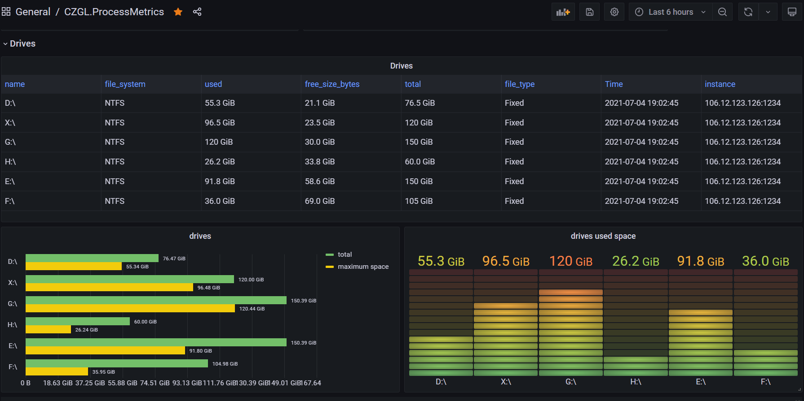
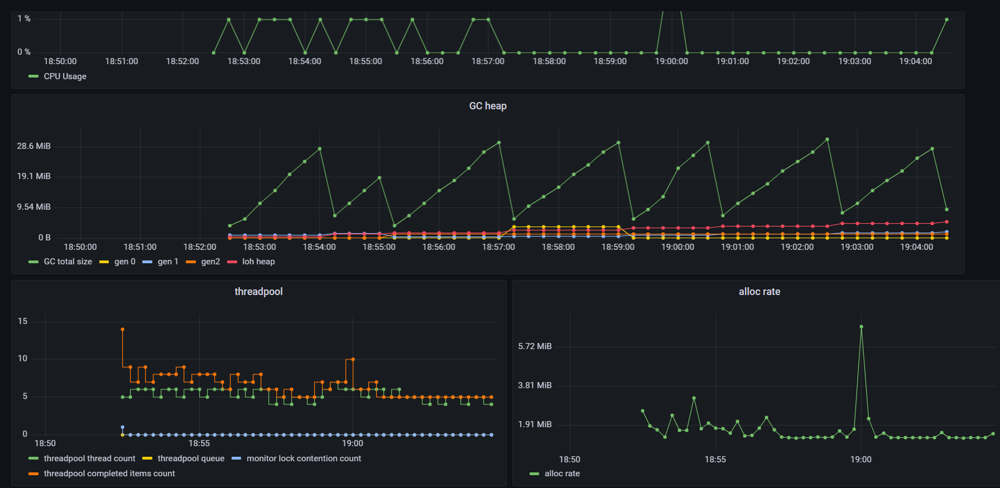
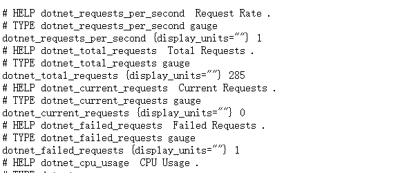
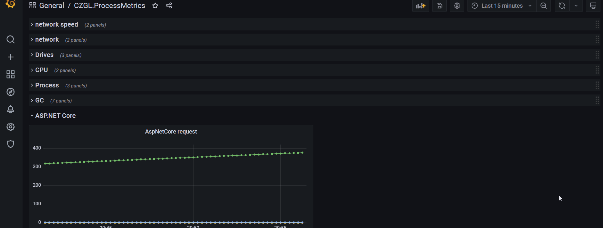

### 导读

CZGL.ProcessMetrics 是一个 Metrics 库，能够将程序的 GC、CPU、内存、机器网络、磁盘空间等信息记录下来，使用 Prometheus 采集信息，然后使用 Grafana 显示。

支持 .NET Core 和 .NET Framework 应用，可在 Wpf、Winfrom 下使用，支持机器多应用，支持多种方式监控和推送数据到处理端。

CZGL.ProcessMetrics 支持自定义数据源、支持监听 .NET EventSource 。


视频地址：

[https://www.bilibili.com/video/BV18y4y1K7Ax/](https://www.bilibili.com/video/BV18y4y1K7Ax/)

教程地址：[https://github.com/whuanle/CZGL.SystemInfo/blob/primary/docs/Metrics.md](https://github.com/whuanle/CZGL.SystemInfo/blob/primary/docs/Metrics.md)

效果图预览：






多机器多应用效果：


### 安装 ProcsssMetrics

只需要通过 Nuget 安装一个库，即可快速为程序添加资源监视，接着可将监控数据收集起来，让 Prometheus 被动捕获或主动推送。

支持三种启动方式。


#### 监控 URL

有两种方式使用 Metrics，第一种是使用内置的 HttpListener，不需要放到 Web 中即可独立提供 URL 访问，适合 winform、wpf 或纯 控制台等应用。但是使用 HttpListener，需要使用管理员方式启动应用才能正常运行。

使用方法：

```csharp
using CZGL.ProcessMetrics;
... ...
MetricsServer metricsServer = new MetricsServer("http://*:1234/metrics/");
metricsServer.Start();
```

> 此方式需要暴露端口和 URL ，由 Prometheus 捕获。


#### ASP.NET Core

另外一种是使用 ASP.NET Core，Metrics 作为中间件加入到 Web 应用中，此时使用的是 kestrel 。

在 Nuget 中，搜索 `CZGL.ProcessMetrics.ASPNETCore` 包，然后使用中间件生成 Metrics 端点。

```csharp
            app.UseEndpoints(endpoints =>
            {
                endpoints.MapControllers();
                endpoints.ProcessMetrices("/metrics");
            });
```


访问相应的 URL，可以看到有很多信息输出，这些都是 Prometheus 数据的格式。

```
http://127.0.0.1:1234/metrics
```




#### 主动推送

主动推送方式，可以不需要绑定端口，也不需要暴露 URL，Wpf、Winfrom 应用可以更加方便地推送数据，也可以将外网内网隔离开来。

部署 Pushgateway：

```shell
docker run -d \
  --name=pg \
  -p 9091:9091 \
  prom/pushgateway
```

> 端口是 9091；也可以使用别的方式部署。


然后在 Prometheus 的 prometheus.yml 文件最后加上：

```shell
  - job_name: 'linux-pushgateway'
    metrics_path: /metrics
    static_configs:
    - targets: ['172.16.2.101:9091']
```


推送监控信息：

```csharp
MetricsPush metricsPush = new MetricsPush("http://127.0.0.1:9091");
var result = await metricsPush.PushAsync();
```


### 自定义 EventSource

在 .NET 中，内置了以下 EventSource：

```
             * Microsoft-Windows-DotNETRuntime
             * System.Runtime
             * Microsoft-System-Net-Http
             * System.Diagnostics.Eventing.FrameworkEventSource
             * Microsoft-Diagnostics-DiagnosticSource
             * Microsoft-System-Net-Sockets
             * Microsoft-System-Net-NameResolution
             * System.Threading.Tasks.TplEventSource
             * System.Buffers.ArrayPoolEventSource
             * Microsoft-System-Net-Security
             * System.Collections.Concurrent.ConcurrentCollectionsEventSource
```


这些 Eventsource 是实现 Metrics、Log、Tracing 的绝佳数据来源，例如在 System.Runtime 中，可以获得以下信息：

```
[System.Runtime]
    % Time in GC since last GC (%)                         0
    Allocation Rate / 1 sec (B)                            0
    CPU Usage (%)                                          0
    Exception Count / 1 sec                                0
    GC Heap Size (MB)                                      4
    Gen 0 GC Count / 60 sec                                0
    Gen 0 Size (B)                                         0
    Gen 1 GC Count / 60 sec                                0
    Gen 1 Size (B)                                         0
    Gen 2 GC Count / 60 sec                                0
    Gen 2 Size (B)                                         0
    LOH Size (B)                                           0
    Monitor Lock Contention Count / 1 sec                  0
    Number of Active Timers                                1
    Number of Assemblies Loaded                          140
    ThreadPool Completed Work Item Count / 1 sec           3
    ThreadPool Queue Length                                0
    ThreadPool Thread Count                                7
    Working Set (MB)                                      63
```


在 CZGL.ProcessMetrics 中，默认只监控了 System.Runtime，如果需要捕获其它 EventSource，则可以通过配置添加：

```csharp
            app.UseEndpoints(endpoints =>
            {
                endpoints.MapControllers();
                endpoints.ProcessMetrices("/metrics", options =>
                {
                    // 监控 CLR 中的事件
                    options.ListenerNames.Add(EventNames.System_Runtime);
                    // 监控 ASP.NET Core 中的请求
                    options.ListenerNames.Add(EventNames.AspNetCore_Http_Connections);
                    
                    options.ListenerNames.Add("自定义的EventSource名称");
                    
                    // 无特殊需求，请不要使用
                    // options.Labels.Add("other", "自定义标识");

                    // 自定义要监控的数据源，可以自由使用
                    // options.Assemblies.Add(..);
                });
            });
```

另外，你也可以自行添加 EventSource，这些 EventSource 可以使用 dotnet-counter、dotnet-dump 等工具捕获。

你可以参考这里，编写 EventSource：[https://github.com/microsoft/dotnet-samples/blob/master/Microsoft.Diagnostics.Tracing/EventSource/docs/EventSource.md](https://github.com/microsoft/dotnet-samples/blob/master/Microsoft.Diagnostics.Tracing/EventSource/docs/EventSource.md)


### 自定义监控数据

在 CZGL.ProcessMetrics 中，内置了一些数据源，这些数据可能来自机器、可能来自应用，但是不一定符合你的需求，你可以自定义添加一些需要的数据指标，例如 wpf 的鼠标点击次数等。

只需要继承 `IMerticsSource` 接口即可。

示例如下：

```csharp
    public class CLRMetrics : IMerticsSource
    {
        public async Task InvokeAsync(ProcessMetricsCore metricsCore)
        {
            await Task.Factory.StartNew(() =>
            {
                Gauge monitor = metricsCore.CreateGauge("dotnet_lock_contention_total", "Provides a mechanism that synchronizes access to objects.");
                monitor.Create()
                    .AddLabel("process_name","myapp")
                    .SetValue(Monitor.LockContentionCount);
            });
        }
    }
```


然后添加需要自定义数据源的程序集，在程序启动时，会主动扫描。

```csharp
endpoints.ProcessMetrices("/metrics", options =>
{
// 监控 CLR 中的事件
options.ListenerNames.Add(EventNames.System_Runtime);
options.Labels.Add("other", "自定义标识");

 // 自定义要监控的数据源
options.Assemblies.Add(typeof(CZGL.ProcessMetrics.MetricsPush).Assembly);
});
```


### 搭建 Prometheus/Grafana

这里我们使用 Docker 来搭建监控平台。

拉取镜像：

```shell
docker pull prom/prometheus
docker pull grafana/grafana 
```

在 `/opt/prometheus` 目录下，新建一个 `prometheus.yml` 文件，其内容如下：

```yaml
# my global config
global:
  scrape_interval:     15s # Set the scrape interval to every 15 seconds. Default is every 1 minute.
  evaluation_interval: 15s # Evaluate rules every 15 seconds. The default is every 1 minute.
  # scrape_timeout is set to the global default (10s).

# Alertmanager configuration
alerting:
  alertmanagers:
  - static_configs:
    - targets:
      # - alertmanager:9093

# Load rules once and periodically evaluate them according to the global 'evaluation_interval'.
rule_files:
  # - "first_rules.yml"
  # - "second_rules.yml"

# A scrape configuration containing exactly one endpoint to scrape:
# Here it's Prometheus itself.
scrape_configs:
  # The job name is added as a label `job=<job_name>` to any timeseries scraped from this config.
  - job_name: 'prometheus'

    # metrics_path defaults to '/metrics'
    # scheme defaults to 'http'.

    static_configs:
    - targets: ['localhost:9090']


  - job_name: 'processmetrice'
    metrics_path: '/metrics'
    static_configs:
    - targets: ['123.123.123.123:1234']
```

> 请替换最后一行的 IP。


使用容器启动 Prometheus：

```shell
docker run  -d   -p 9090:9090   -v /opt/prometheus/prometheus.yml:/etc/prometheus/prometheus.yml    prom/prometheus
```
使用容器启动 Grafana：
```shell
mkdir /opt/grafana-storage
chmod 777 -R /opt/grafana-storage
docker run -d   -p 3000:3000   --name=grafana   -v /opt/grafana-storage:/var/lib/grafana   grafana/grafana
```


打开 9090 端口，在菜单栏中打开 `Status-Targets`，可以看到有相关记录。


接着，访问 3000 端口，打开 Grafana，初始账号密码都是 admin 。


### 配置 Grafana

首先我们要为 Grafana 获取 Prometheus 中的监控数据，我们要添加一个数据源。


选择 Prometheus，按照提示，填写好 `HTTP-URL` 即可。


接着，下载笔者定制好的 Jsom Model，文件名为 `CZGL.ProcessMetrics.json`。

下载地址：
[https://github.com/whuanle/CZGL.SystemInfo/releases/tag/v1.0](https://github.com/whuanle/CZGL.SystemInfo/releases/tag/v1.0)

然后导入模型文件。


即可看到监控界面。

